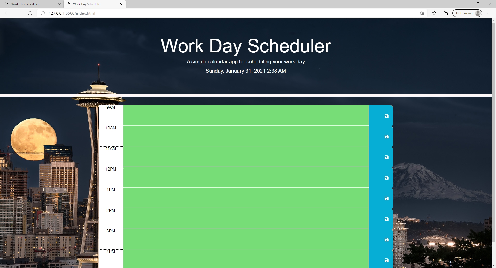

# Day Planner

## Description
The purpose of this project was to create a regular 9 A.M - 5 P.M. work day-planner. The planner can be saved and changed for each hour. Past, present and future tasks are highlighted to inform current status of events; grey being past, red being present, green be future events.

### How to use?
GIVEN I am using a daily planner to create a schedule
WHEN I open the planner
THEN the current day is displayed at the top of the calendar
WHEN I scroll down
THEN I am presented with time blocks for standard business hours
WHEN I view the time blocks for that day
THEN each time block is color-coded to indicate whether it is in the past, present, or future
WHEN I click into a time block
THEN I can enter an event
WHEN I click the save button for that time block
THEN the text for that event is saved in local storage
WHEN I refresh the page
THEN the saved events persist

### Sources

- [Moment.js](https://momentjs.com/)
- [jQuery/learningcenter](https://learn.jquery.com/)
- [JSON W3Schools](https://www.w3schools.com/js/js_json_intro.asp)
- [StackOverflow](https://stackoverflow.com/)
- [W3Schools](https://www.w3schools.com/)
- [Developer Mozilla](https://developer.mozilla.org/en-US/docs/Web/JavaScript)

### Contributors:

* matachemarius92@gmail.com
* [Matache Marius](https://github.com/MatacheMarius)
### Directory:
* [Current Repository](https://github.com/MatacheMarius/Day-Planner)
* [Website](https://matachemarius.github.io/Day-Planner/.)
